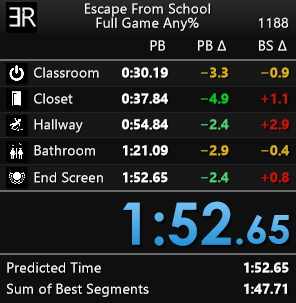

# Escape From School - Layouts

### **[LiveSplit](https://github.com/LiveSplit) layouts you can use for a run submission on [Speedrun.com](https://www.speedrun.com/escape_from_school).**

### Layouts:
- Datailed:
  - Game and run category details.
  - Splits details (Name, PB Time, PB Delta, BS Delta).
  - Timer with hundredth-of-a-second precision. 
  - Predicted time.
  - Sum of best segments.
- Minimalist: _minimum requirements for a run submission on [Speedrun.com](https://www.speedrun.com/escape_from_school)_.
  - Timer with hundredth-of-a-second precision.

### Layout previews:
<table style="margin-left: auto; margin-right: auto;">
  <tr>
    <th>
      Detailed
    </td>
    <th>
      Minimalist
    </td>
  </tr>
  <tr>
    <td>
      </img>
    </td>
    <td>
      </img>
    </td>
  </tr>
</table>

### Compatibiliy:
- Works with the [autosplitter](https://github.com/Zeuba-Speedruns/AutoSplitters/tree/main/Escape%20From%20School) available in [LiveSplit](https://github.com/LiveSplit).
- Works with these [splits files](https://github.com/Zeuba-Speedruns/Splits/tree/main/Escape%20From%20School).

### Contact:
- If you have any issues ask in the ["Escape From School - Speedrun" Discord server](https://discord.gg/PMTxSJWYTs).
